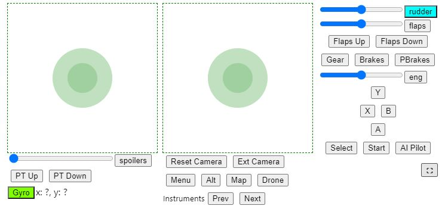

## Explanation
Uses [vJoy](http://vjoystick.sourceforge.net/site/index.php/download-a-install/download) to emulate a virtual joystick. 
Python is used to the load vJoy.dll, and communicates with a react web app to recieve joystick commands from a website. This can be run on any phone or desktop.

### Installing vJoy
[Install vJoy](http://vjoystick.sourceforge.net/site/index.php/download-a-install/download).
Script needs a vJoy device, so run "vJoyConf.exe" in the vJoy install location or from start menu (C:/Program Files/vJoy/x64/vJoyConf.exe).
Currently script uses the following settings: 
- vJoy device: 1
- All axes enabled
- 32 buttons
- Effects disabled (vibration etc)

### Running virtual joystick
```bash
cd controller
python3 main.py
# CTRL-C to terminate
# go to your localaddress to get ui
# E.g. localhost:3000, 192.168.x.x:3000
```

### Example UI
UI for Microsoft Flight Simulator 2020.



### Changing UI
UI is written using ReactJS. Run below commands to start development server.
```bash
cd web/vjoy
# OPTIONAL: install npm modules
# You need yarn and node for this
yarn install
# run the development server for react website
yarn start
# build the website once you are done
yarn build
```
